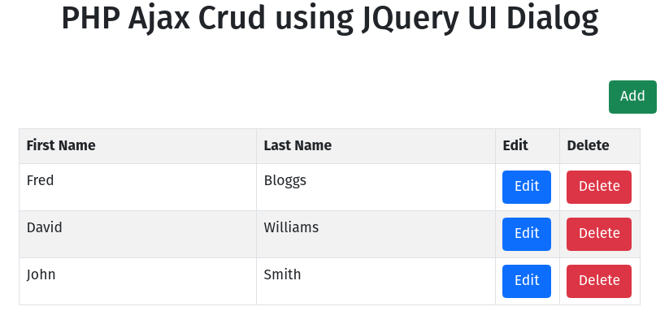

# PHP AJAX CRUD using jQuery UI Demo

The original
source: [WebsLesson PHP Ajax Crud using JQuery UI Dialog](https://www.webslesson.info/2018/03/php-ajax-crud-using-jquery-ui-dialog.html)

This is a PHP AJAX CRUD app. It performs basic CRUD operations, using jQuery Ajax calls, to a PHP backend.

The idea is to update the app to resemble an MVC framework.

## TODO

- [x] Add Docker, docker-compose and Makefile to allow the app to be easily started and stopped
- [x] Set up the database
- [x] Move the database config out of the public directory
- [x] Separate the css and js from the html
- [x] Add the README.md and LICENSE
- [x] Create GitHub repo
- [x] Add composer
- [x] Add tooling: ECS, PHPUnit, PhpStan and Rector (jakzal/phpqa:1.50-php7.4-alpine)
- [ ] Add CRUD tests using SQLite in memory DB
    - [ ] refactor PHP files for testing environment (add **config** to **.env**)
- [ ] Refactor PHP files to classes
    - [ ] Add namespacing and auto-loading
- [ ] Move jQuery script out of index.html into own file in js directory
- [ ] Refactor PHP classes to API endpoints
- [ ] Refactor PHP to return JSON, move view logic from PHP files into jQuery
- [ ] Refactor PHP PDO prepared statements

## Requirements

- PHP 5.6+
- Apache
- MySQL

This set up can be created, using the provided **Dockerfile**, **docker-compose** and **Makefile**.

## Installation

The project can be installed in several ways. As this a personal project can be cloned, forked or downloaded using zip.
e.g. using git clone

```sh
git clone git@github.com:Pen-y-Fan/php-ajax-crud-using-jquery-ui-demo.git 
```

For other ways see [github docs](https://docs.github.com/en/github/using-git/which-remote-url-should-i-use).

## Usage

The easiest way it to use the provided Makefile, which will spin up the Docker environment:

```sh
make up
```

You can check if you have make installed by running `make --version`

Without make the following docker-compose command can be used:

```sh
docker-compose up --build --remove-orphans -d
```

## Configuring the database

If you are using **Docker** with the supplied **docker-config** you do not need to alter any settings for the database.

If you want to use your own local setup, you can change the configuration by editing the **database_settings.php** file.
This has variables for the host name, database name, username and password. If you wish to use your own, local settings,
edit this file and enter your settings. PHP PDO is used, meaning many SQL databases can be used, it is currently
configured for MySQL.

Once you are happy with the configuration the database, table and sample data can be created.

```sh
make build
```

Or the docker command:

```sh
docker-compose exec -u 100:101 ajaxcrud php /app/build_db.php
```

You should see output like:

```sh
docker-compose exec -u 100:101 ajaxcrud php /app/build_db.php
Building db
Database database created OK
Creating table tbl_sample
Table tbl_sample created
Adding sample data
3 names added to table
```

Open your browser to <http://localhost:8080> and view the app.



Note: Rerunning the build command will add the 3 names again. It will not drop the table or database, if they already
exist.

## License

See [MIT license](./LICENSE.md).
